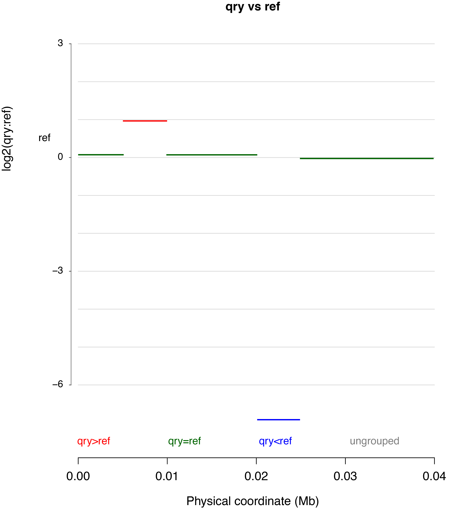

### Demo to run CGRD with sample data

#### step 1: prepare data  
In this demo, 40 kb *E. coli* sequence was extracted from the Genbank accession NC_000913.3 as the reference genome \([ref](./genome/ref.fasta)\).  

A 50 kb insertion and a 50 kb deletion were introduced in a qrery genome \(qry\).  

Paired-end reads 2x100 bp were simulated from each genome, producing data:  
reads from the ref genome: [read1](./reads/ref.1.fastq) and [read2](./reads/ref.2.fastq)  
reads from the qry genome: [read1](./reads/qry.1.fastq) and [read2](./reads/qry.2.fastq)

#### step 2: run CGRD (1-3 minutes of running time)  
The example [code](cgrd.run.sh) can be run with the prepared data.  
```
#!/bin/bash

ref=./genome/ref.fasta
reffq1=./reads/ref.1.fastq
reffq2=./reads/ref.2.fastq
qryfq1=./reads/qry.1.fastq
qryfq2=./reads/qry.2.fastq

perl cgrd --ref $ref \
	--subj ref --sfq1 $reffq1 --sfq2 $reffq2 \
	--qry qry -qfq1 $qryfq1 -qfq2 $qryfq2 \
	--threads 1
```

#### step 3: check results  
Here are three major output files: 

1. [cgrdo_qry_ref.report.html](cgrdo_qry_ref.report.html): summary of CGRD output  
2. [cgrdo_qry_refsegments.txt](cgrdo_qry_refsegments.txt): a flat text file to show comparison result  
3. [qry_refcgrd.pdf](qry_refcgrd.pdf): visualization plot as the following figure



